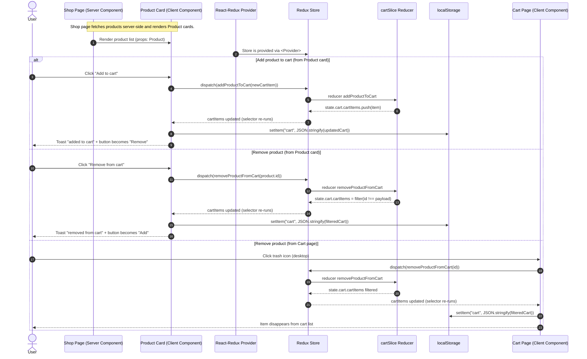
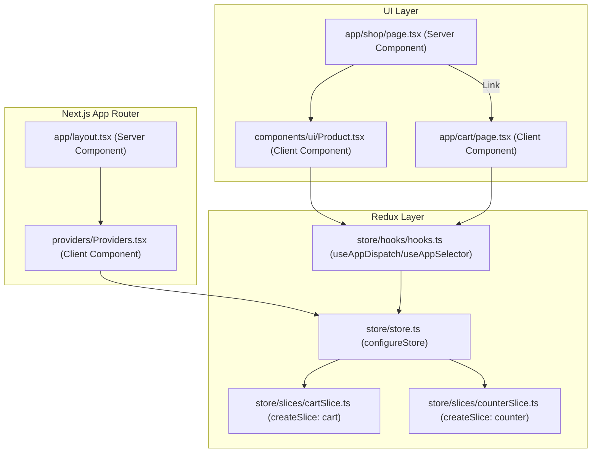
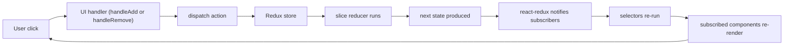
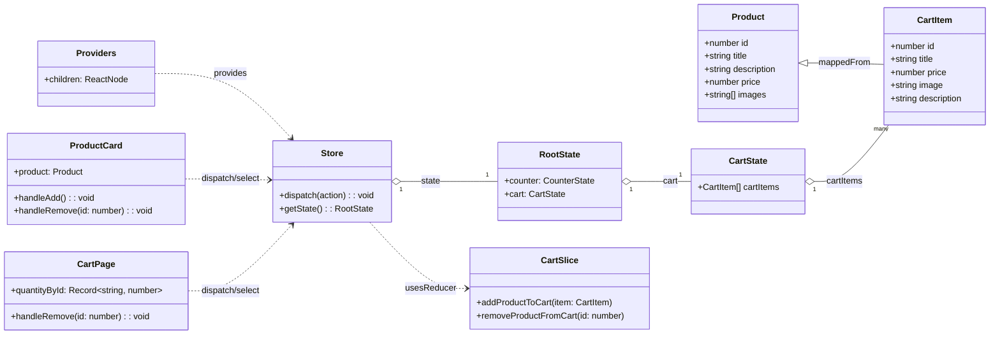
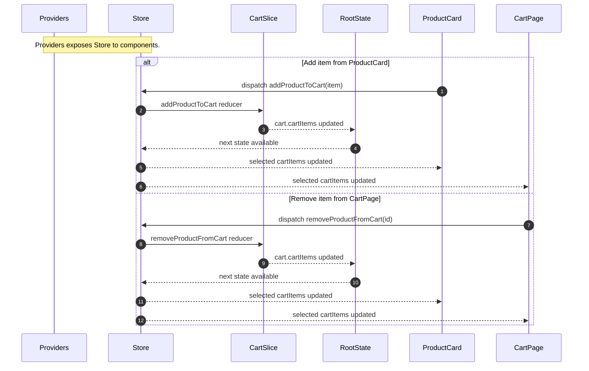
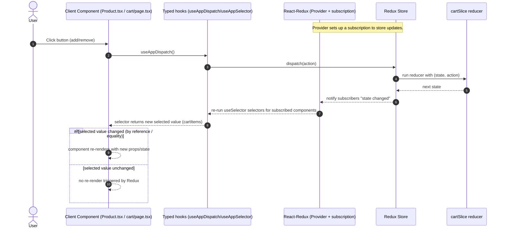
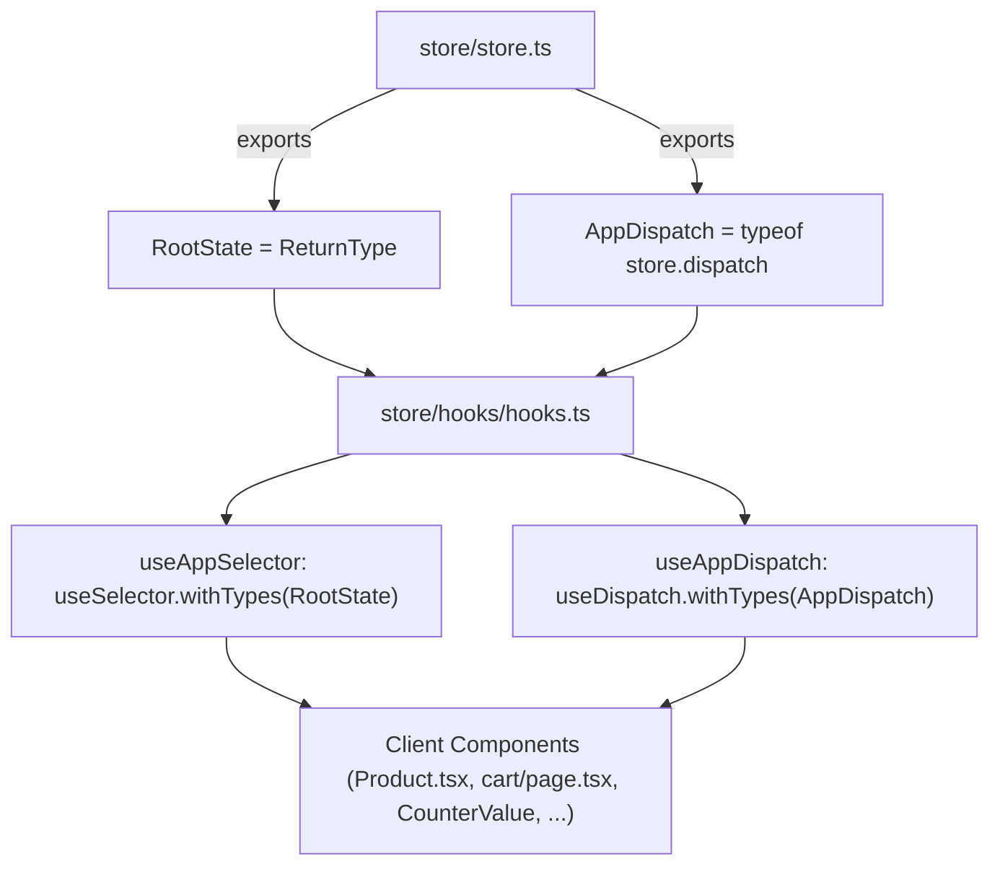
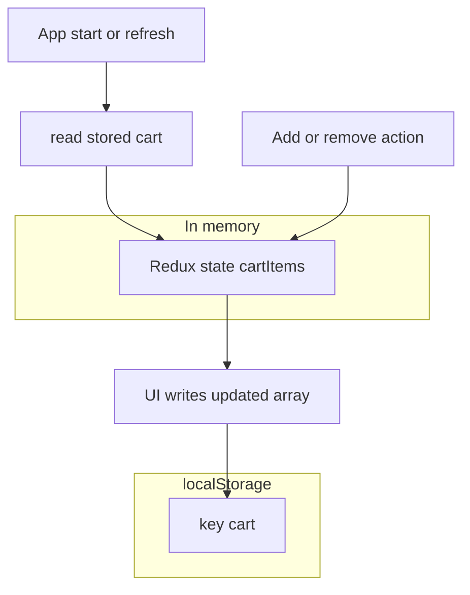

# Redux Cart Flow (Next.js App Router) — Lecture Notes

This project implements a simple cart using **Redux Toolkit** + **React Redux** in a **Next.js (App Router)** application.

## Key files (what they do)

- **`types/types.ts`**: Source of truth for the `Product` shape returned by the API (`dummyjson.com`).
- **`actions/products.tsx`**: Server-side data fetch for products (`getAllProducts()`).
- **`app/shop/page.tsx`**: Server Component that fetches products and renders a list of `<Product />` cards.
- **`components/ui/Product.tsx`**: Client Component that lets the user add/remove the product to/from the cart (Redux + `localStorage` + toast).
- **`store/slices/cartSlice.ts`**: Redux Toolkit slice with `addProductToCart` / `removeProductFromCart` reducers and a `localStorage`-based initial state.
- **`store/store.ts`**: Redux store configuration (registers `cart` and `counter` slices).
- **`store/hooks/hooks.ts`**: Typed hooks (`useAppDispatch`, `useAppSelector`) for type-safe access to Redux.
- **`providers/Providers.tsx`**: Client wrapper that mounts React Redux `<Provider store={store} />` (and the toast `<Toaster />`).
- **`app/layout.tsx`**: Root layout that wraps the entire app with `<Providers>`.
- **`app/cart/page.tsx`**: Client cart page that reads `cartItems` from Redux and can remove items (also handles quantities locally).

## Redux wiring (how state becomes global)

### 1) Store creation

- `store/store.ts` creates a Redux store via `configureStore()`.
- It registers reducers under keys:
  - `counter`
  - `cart`

### 2) Provider at the root

- `providers/Providers.tsx` is a **Client Component** (`"use client"`).
- It renders:
  - `<Provider store={store}>` to make the Redux store available to all descendants
  - `<Toaster />` for toast notifications

### 3) Layout wraps the whole app

- `app/layout.tsx` uses `<Providers>` so every route can dispatch actions and read state.

### 4) Typed hooks for dispatch/select

- `store/hooks/hooks.ts` defines:
  - `useAppDispatch` (typed dispatch)
  - `useAppSelector` (typed selector)

This avoids repeatedly typing `RootState` and `AppDispatch` across components.

## Cart state model (what’s in Redux)

### State shape (cart slice)

- `state.cart.cartItems` is an array of cart items.
- The cart slice reads from `localStorage` at initialization to preload persisted cart contents.

### Persistence (important detail)

- **Redux is the source of truth in-memory.**
- `localStorage` is updated manually in UI components after dispatching actions.
- On refresh, the cart slice initializes from `localStorage` again.

## Flow: Add product to cart (Shop → Product card)

### Where it starts

- The user is on `app/shop/page.tsx` (server-rendered list).
- Each product is rendered using the client component `components/ui/Product.tsx`.

### What happens when “Add to cart” is clicked

- `Product.tsx` builds `newCartItem` from the `Product` data.
- It dispatches `addProductToCart(newCartItem)`.
- The cart reducer pushes the item into `state.cart.cartItems`.
- The component writes the updated array to `localStorage`.
- A toast is shown, and UI toggles to “Remove from cart” because:
  - `useAppSelector` observes the updated Redux state
  - `useEffect` recomputes `existing` based on `cartItems`

## Flow: Remove product/item from cart

There are **two removal entry points** in this project:

### A) Remove from the product card (Shop page)

- Click “Remove from cart” in `components/ui/Product.tsx`.
- Dispatch `removeProductFromCart(product.id)`.
- Update `localStorage` to remove the item.
- The UI flips back to “Add to cart”.

### B) Remove from the cart page

- Go to `app/cart/page.tsx`.
- Click the trash button (desktop has `onClick`, mobile icon currently renders without an `onClick`).
- `handleRemove(id)` dispatches `removeProductFromCart(id)` and updates `localStorage`.
- The cart list re-renders from Redux state.

> Note: Quantity and totals are **local component state** in `app/cart/page.tsx` (`quantityById`). They are not stored in Redux.

## Mermaid sequence diagram (Add + Remove)

---

## Additional diagrams (Redux / Store / Slice / Providers)

### 1) App architecture diagram (Provider → Store → UI)

### 2) Redux update cycle (what happens on a click)

### 3) “Redux classes” view (UML-ish class diagram)

### 3.1) Sequence diagram based on the class diagram (state update using Store + CartSlice)

### 4) React-Redux subscription + re-render boundaries (why only some components re-render)

### 5) Typed hooks “type flow” (where RootState/AppDispatch come from)

### 6) Persistence boundaries (Redux vs localStorage)

